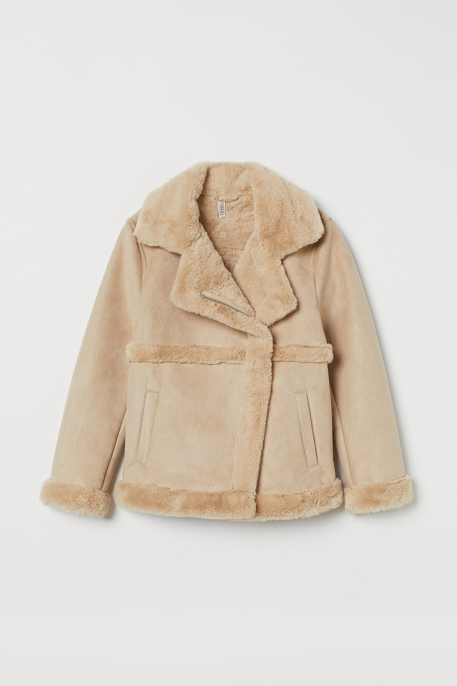
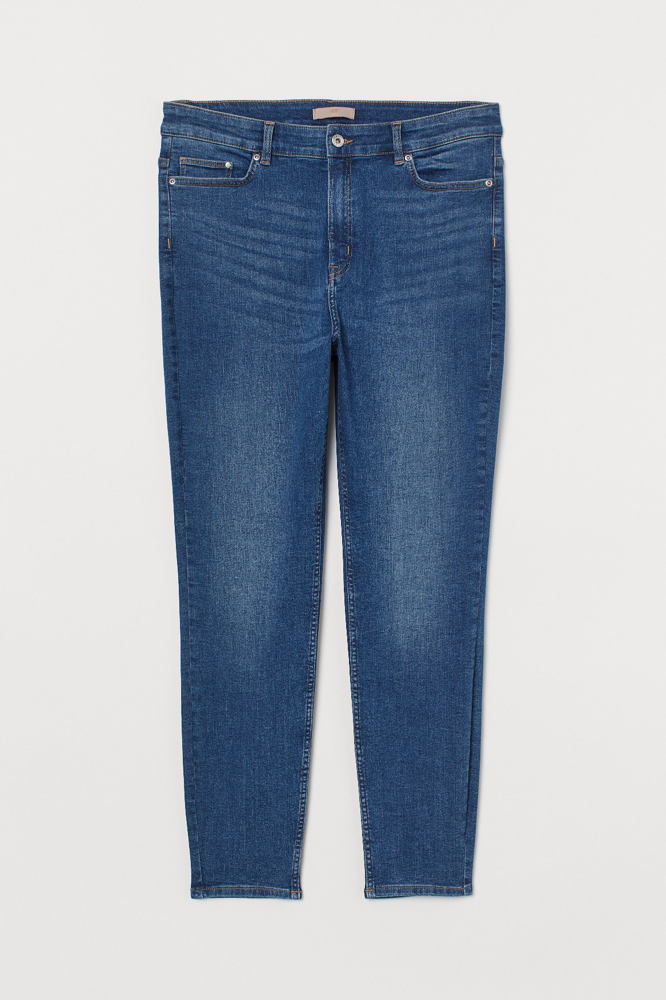
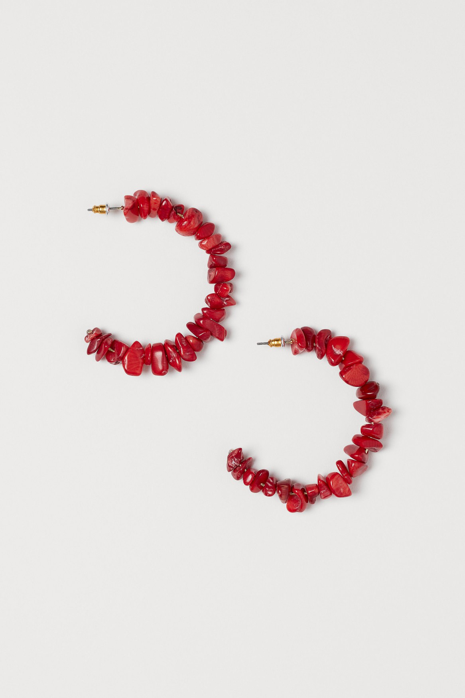

# product-images-captioning

Данный репозиторий содержит код моделей, которые можно использовать для генерации описаний товаров магазинов одежды.

## Зависимости
* Python 3.10.X
* torch==1.13.0 (GPU/CPU)
* `pip install requirements.txt`

## Запуск
* Обучение + валидация:
`python src/train.py`, файл с конфигурацией — <i>configs/train.yaml</i>.
* Тестирование:
`python src/test.py`, файл с конфигурацией — <i>configs/test.yaml</i>.
* Предсказание на одном изображении:
`python src/inference.py`, файл с конфигурацией — <i>configs/inference.yaml</i>.
* Создание обработанных датасетов из исходного:
```
Usage: python src/create_dataset.py [OPTIONS]
Options:
  --input-dataset-filepath TEXT  [required]
  --output-dir TEXT              [required]
  --image-dir TEXT               [required]
  --val-size FLOAT
  --test-size FLOAT
  --seed INTEGER
```

## Данные

Для обучения и оценки качества модели используются данные из соревнования 
[H&M Personalized Fashion Recommendations](https://www.kaggle.com/competitions/h-and-m-personalized-fashion-recommendations).

Из датасета были удалены записи с дублирующимися описаниями и записи, не имеющие соответствующих картинок.

Для проведения экспериментов данные были разбиты на три части: <i>train (80%)</i>,
<i>val (10%)</i>, <i>test (10%)</i>. <i>Train</i> использовалась для обучения моделей, <i>val</i> — для подбора
гиперпараметров, на <i>test</i> проводилась финальная оценка качества.

### Извлечение признаков

Исходные изображения приводились к размеру 224x224 и нормализовывались с использованием следующих статистик:
`'mean': [0.5, 0.5, 0.5], 'std': [0.5, 0.5, 0.5],`.

Токенизация текста производилась при помощи tokenizer'а используемого decoder'а (каждый токен сопоставлялся с целым числом
от 0 до <i>N - 1</i>, где <i>N</i> — мощность словаря).
К словарь были добавлены специальные токены: `'[PAD]'` — для уравнивания длин последовательностей,
`'[BOS]'` — для обозначения начал последовательностей, `'[EOS]'` — для обозначения окончаний последовательностей.

## Модель

Для решения задачи используется архитектура Encoder-Decoder.
В качестве encoder'а используется [vit-base-patch16-224](https://huggingface.co/google/vit-base-patch16-224),
в качестве decoder'а [distilgpt2](https://huggingface.co/distilgpt2).
На вход модели передавались признаки, извлеченные из изображений. На выходе получалась последовательность идентификаторов токенов,
которые переводились в текст.

## Метрика

Для оценки качества работы модели была использована метрика [SacreBLEU](https://github.com/mjpost/sacrebleu) 
(используется [данная реализация](https://huggingface.co/spaces/evaluate-metric/sacrebleu) с параметрами по умолчанию).
Метрика [BLEU](https://en.wikipedia.org/wiki/BLEU) была создана для оценки качества машинного перевода, но может быть применима
для любой задачи из семейства seq2seq.

## Результаты экспериментов

Среди множества гиперпараметров в основном подбирались, отвечающие за генерацию последовательностей.
Например, допустимая максимальная длина текста, штрафы за повторения и однообразность, размер N-грамм,
которые могут повторяться. Ниже приведены два набора параметров, показавших наилучшие значения метрик.

* Param set #1
```python
{
    'max_length': 64,
    'num_beams': 6,
    'num_beam_groups': 2,
    'early_stopping': True,
    'no_repeat_ngram_size': 2,
    'length_penalty': 2.0,
    'repetition_penalty': 3.0,
    'diversity_penalty': 2.0,
}
```
* Param set #2 
```python
{
    'max_length': 64,
    'num_beams': 4,
    'num_beam_groups': 1,
    'early_stopping': True,
    'no_repeat_ngram_size': 2,
    'length_penalty': 3.0,
    'repetition_penalty': 3.0,
    'diversity_penalty': 0.0,
}
```

|              | SacreBLEU Val   | SacreBLEU Test |
| :----------: | :-------------: | :------------: |
| Param set #1 | 19.594          | 18.793         |
| Param set #2 | 21.494          | 21.732         | 

## Примеры работы

<table>
    <tr>
        <td width="50" style="text-align: center"><b>Изображение из тестового набора</b></td>
        <td style="text-align: center"></td>
        <td style="text-align: center"></td>
        <td style="text-align: center"></td>
    </tr> 
    <tr>
        <td width="50" style="text-align: center"><b>Оригинальное описание</b></td>
        <td>Biker jacket in imitation suede with a faux fur lining and details. Notch lapels, a diagonal zip down the front and side pockets</td>
        <td>5-pocket trousers in stretch twill with a high waist, zip fly and button and skinny legs.</td>
        <td>Hoop earrings in metal with beads made from reconstituted stones. Diameter 6 cm.</td>
    </tr>
    <tr>
        <td width="50" style="text-align: center"><b>Сгенерированное описание</b></td>
        <td>Double-breasted jacket in soft faux fur with notch lapels, concealed press-studs down the front and a single back vent. Lined.</td>
        <td>5-pocket jeans in washed, stretch denim with a regular waist, zip fly and button and skinny legs.</td>
        <td>Hoop earrings in metal decorated with plastic beads.</td>
    </tr>
    <tr>
        <td width="50" style="text-align: center"><b>SacreBLUE</b></td>
        <td style="text-align: center">13.833</td>
        <td style="text-align: center">46.513</td>
        <td style="text-align: center">7.764</td>
    </tr>
</table>

## Ресурсы

Среднее время работы на одном изображении ~ 3.305s. Среднее потребление памяти ~ 4.2GB. Для замеров использовалась
функция `torch.profiler.profile(...)`. 

Измерения производилось на CPU (AMD Ryzen 7 5700U).
